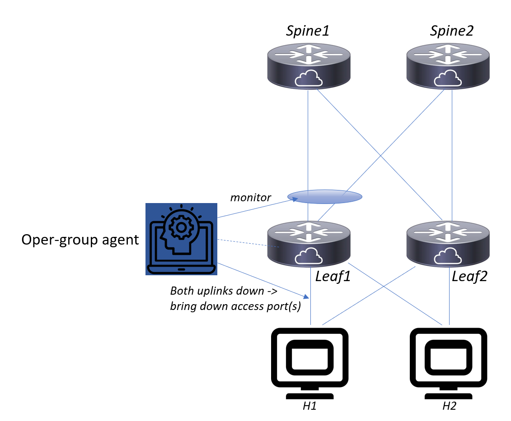

# srl-opergroup-agent
SR Linux agent to implement operational groups where target elements are administratively disabled if a monitored link or session goes down



# Use case: uplink monitoring

Monitor operational state of a link:
```
gnmic -a clab-opergroup-lab2-spine1:57400 -u admin -p admin --skip-verify -e json_ietf get --path /interface[name=ethernet-1/1]/oper-state
```
The result will be "up" or "down". Accordingly, set admin-state to "enable" or "disable" for all target elements:
```
gnmic -a clab-opergroup-lab2-spine1:57400 -u admin -p admin --skip-verify -e json_ietf set --update-path /interface[name=ethernet-1/2]/admin-state --update-value "disable"
```

Similarly, a BGP session can be monitored or disabled. Generator expressions can be used to enumerate multiple targets (expanded to multiple gNMI SET commands):
/interface[name=ethernet-1/(2|4|5-7)]/admin-state

# Demo scenario

Inspect the uplinks and host facing links:
```
info from state interface ethernet-1/{1..4} | filter fields admin-state oper-state
```

Check the oper-group policy:
```
info /opergroup-agent
```

Take down first uplink:
```
enter candidate
set /interface ethernet-1/1 admin-state disable
commit stay
```

Check that opergroup agent brought down the access ports:
```
info /interface ethernet-1{3,4}
```

## Caveats and learnings
Currently (SRL 21.6.2) no gNMI 'delete' events are generated for /bfd/network-instance[name=default]/peer[local-discriminator=*]/oper-state.
This could cause the agent to retain stale state for BFD sessions that no longer exist, counting them as 'down'.
To resolve this, the agent retrieves the updated state for all entries when triggered by an on-change event.
